# 实验报告

## 1 实验题目

- 图书销售管理系统的设计与实现
- 项目地址：[demo](https://github.com/jqdai/bookstore_management_system)

## 2 开发环境

- 操作系统：Windows 10 64位（DirectX 12）
- IDE：pycharm 2020.1（专业版）
- 数据库管理软件：sqlite3
- 编程语言：python 3.8
- Web开发环境：django 3.0.5

## 3 数据库设计

介绍本项目的数据库设计，给出系统数据库的 ER 图，对每个表的功能和属性进行说明。

### 3.1 数据库设计简介与 ER 图

- 本项目共设计有 7 个模式: Admin, Phone, Publisher, Category, Author, Book, Transaction
- ER 图如下图所示


### 3.2 各模式功能与属性说明

#### 3.2.1 Admin

属性

- id: 自动生成的主码
- user: 利用 django 自带的用户系统维护用户名、密码、邮箱等信息
- name: 真实姓名
- gender: 性别
- age: 年龄
- address: 住址（复合属性本应拆分为 city、street 等属性，此处简化为普通属性，无伤大雅）

方法

- __str\_\_(self): 返回用户名（注意是 self.**user**.get_username()）

功能

- 在 django 自带用户系统的基础上扩充几个信息，但真正起到登录、改密码等作用的是自带的 django.contrib.auth.models.User
- 在 Transaction 模式中，每条交易记录要注明是谁下的单，就是通过 ruler 属性记录的 Admin（其实是 username）实现的
- 通过 ForeignKey 成为 Transaction 模式的 ruler 属性，表示每个订单的负责人。一个订单只能有唯一的负责人，而一个管理员可以下很多单
- 通过 ForeignKey 利用 Phone 模式储存电话号码，电话号码仅在管理员个人信息界面以列表形式展示且不支持修改（超级管理员可以）
- 支持检索和修改信息

#### 3.2.4 Phone

属性

- id: 自动生成的主码
- admin: 改电话号码的所属者，通过 ForeignKey 利用 User 储存
- number: 电话号码

方法

- __str\_\_(self): 返回电话号码

功能

- 维护所有管理员的电话号码，并在其详细信息界面以列表形式展示。不支持修改和检索
- 处理一名管理员多个电话号码问题
- 通过 ForeignKey 为 Admin 模式储存 phone 属性
- 展现了 django 中多值属性处理方法

#### 3.2.3 Publisher

属性

- id: 自动生成的主码
- name: 出版社名称

方法

- __str\_\_(self): 返回出版社名称
- get_absolute_url(self): 返回一个通向该出版社详细信息页的 url，以其 id 属性作为参数，并显示其出版的图书

功能

- 维护所有出现过的出版社名称，并在其详细信息页显示其名称、出版书籍等信息且可修改
- 通过 ForeignKey 成为 Book 模式的 publisher 属性，表示每本图书的出版社。一本书只能有唯一的出版社，而一个出版社可以出版多本图书
- 支持检索和修改信息

#### 3.2.4 Category

属性

- id: 自动生成的主码
- name: 属性名称

方法

- __str\_\_(self): 返回类型名称
- get_absolute_url(self): 返回一个通向该类型详细信息页的 url，以其 id 属性作为参数，并显示其分类下的图书

功能

- 维护所有出现过的类型，并在其详细信息页显示其姓名、分类下的图书等信息且可修改
- 通过 ManyToManyField 成为 Book 模式的 category 属性，表示每本图书所属的类型。一本书可以属于多个类型，一个类型也可以有多本书
- 支持检索和修改信息
- 此处和下面的 Author 模式一样，体现了多值属性在 django 中的特性和使用方法

#### 3.2.5 Author

属性

- id: 自动生成的主码
- name: 作者姓名

方法

- __str\_\_(self): 返回作者姓名
- get_absolute_url(self): 返回一个通向该作者详细信息页的 url，以其 id 属性作为参数，并显示其创作的图书

功能

- 维护所有出现过的作者姓名，并在其详细信息页显示其姓名、所作图书等信息且可修改
- 通过 MayToManyField 成为 Book 模式的 author 属性，表示每本图书的作者。一本书可以有多个作者，一个作者也可以写多本书
- 支持检索和修改信息

#### 3.2.6 Book

属性

- id: 自动生成的主码
- ISBN: ISBN国际书号
- language: 语言
- author: 作者，通过 ManyToManyField 用 Author 模式储存
- publisher: 出版社， 通过 ForeignKey 用Publisher 模式储存
- price: 零售价
- inventory: 库存数量
- category: 类型，通过 ManyToManyField 用 Category 模式储存
- summary: 简介（摘要）

方法

- __str\_\_(self): 返回一个表示图书信息的字符串：《书名》，作者，国际书号，出版社
- get_absolute_url(self): 返回一个通向该图书详细信息页的 url，以其 id 属性作为参数，并显示其交易记录
- get_author(self): 返回图书全部作者，根据图书去 Author 模式中查找相应的作者，若有多位则使用'，'.join(...)的方法返回一个字符串
- get_category(self): 返回图书全部类型，根据图书去 Category 模式中查找相应的类型，若有多个则使用'，'.join(...)的方法返回一个字符串

功能

- 维护所有出现过的图书，并在其详细信息页显示其名称、国际书号、作者、出版社等信息且可修改
- 通过 MayToManyField 利用 Author 模式储存作者信息，避免冗余和不一致
- 通过 ForeignKey 利用 Publisher 模式储存出版社信息，避免冗余和不一致
- 通过 ForeignKey 成为 Transaction 模式的 book 属性，表示每条交易记录的交易主体。一条记录只能有唯一的交易主体，一本书也可以有多条交易记录
- 支持检索和修改信息

#### 3.2.7 Transaction

属性

- in_out: 区别订单类型，是进货还是出货
- book: 交易主体，通过 ForeignKey 利用 Book 模式储存
- ruler: 订单负责人（下单人）， 通过 ForeignKey 利用 Admin 模式储存
- cost: 成交金额。若是进货，则表示进价；若是出货，则表示零售价
- amount: 成交量
- time: 成交时间，由系统自动生成
- paid: 订单付款状态。不在库中的图书进货和库存图书销售下单后自动设为“已付款”，库存图书进货则设为“未付款”。对未付款订单，可以手动付款，状态更新为“已付款”，同时自动增加库存量；也可选择退货，状态更新为“已退款”，不更新库存

方法

- __str\_\_(self): 返回一个表示订单的字符串
- recent_deal(self): 返回在过去一天内成交的订单（实际并未使用）

功能

- 维护所有成交过的订单，可根据自定义的时间范围检索
- 通过 ForeignKey 利用 Book 模式储存商品信息，避免冗余和不一致

## 4 系统设计

这里主要展现实验要求中要求的十一条，其余的放在第 5 节中展示

### 4.1 用户管理

- 所有注册账号均能访问 127.0.0.1:8000\bookstore（以下简称主页），在主页上可以买卖图书，修改自己的信息和账号密码，查看数据库储存的各种信息
- 登录状态下访问主页可以看到主页显示的内容，未登录状态下访问主页会自动跳转到登录页，先登录再使用
- 鉴于实验要求中注明，本站用于服务书店管理员，因此不需要考虑书店顾客的情况。在本系统中，区别超级管理员和普通管理员的方法是能否登录 django 自带的 admin 站点
- 只有超级管理员才有权限登录 admin 站点，在该站点中超级管理员除了能进行主页上的操作外，可以查看、修改其它管理员的个人信息，也能新增管理员
- 超级管理员是项目建立时通过以下命令建立的，普通管理员则是超级管理员在 admin 站点手动建立的
```text
py manage.py createsuperuser
```
- 由于本系统利用了 django 自带的用户管理系统，因此密码加密方式采用了其默认的 pbkdf2_sha256 算法
- 下图是超级管理员编辑其它管理员信息时的情形
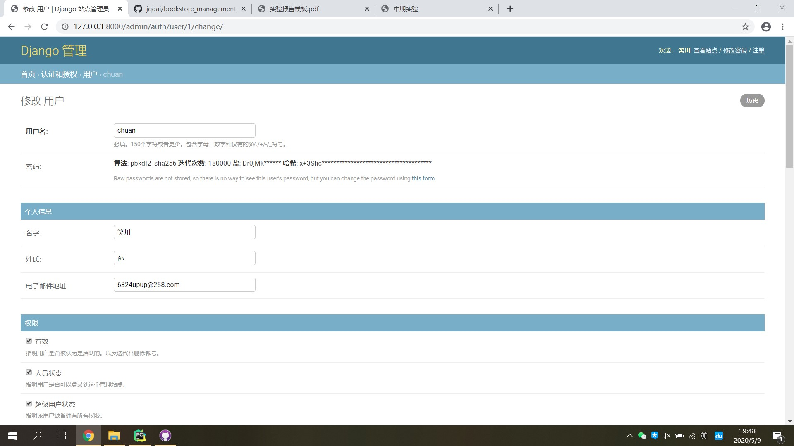
- 每位用户除了用户名和密码信息外，还有姓名，性别，年龄，住址，电话等基本信息
- 本系统中，views 中所有视图都加上了@login_required，因此所有网页的内容必须登录后才能查看
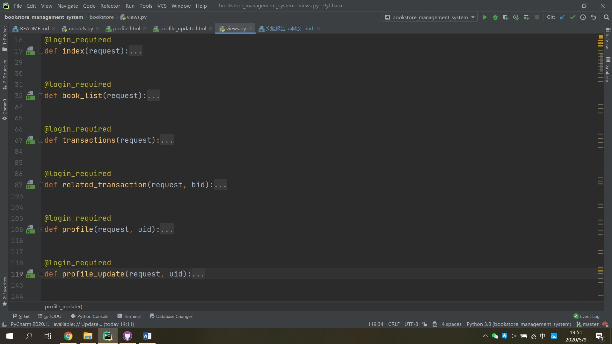
- 登录注销和修改密码界面展示效果如下
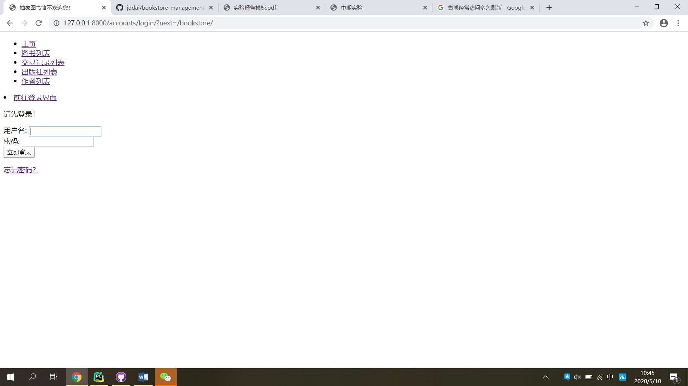
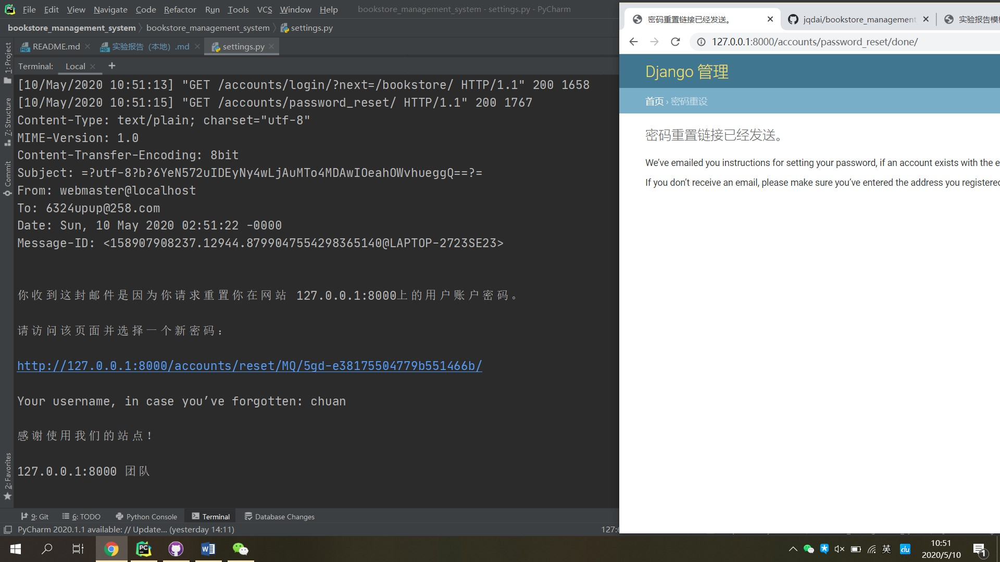
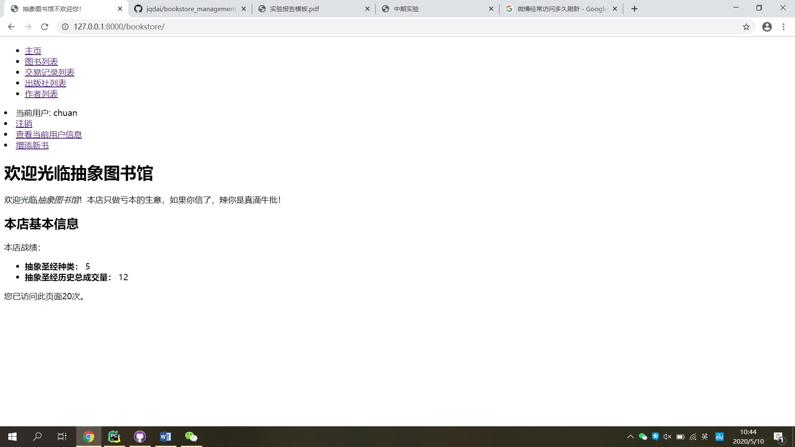

### 4.2 库存书籍管理

- 系统维护的书籍信息包括ISBN号，书籍名称，语言，作者，出版社，零售价格，当前库存数量等
- 图书信息模式设计如 views.py 中 Book 模式所示
- 库存图书列表见 4.3 节
- 图书详细信息展示效果如下图所示
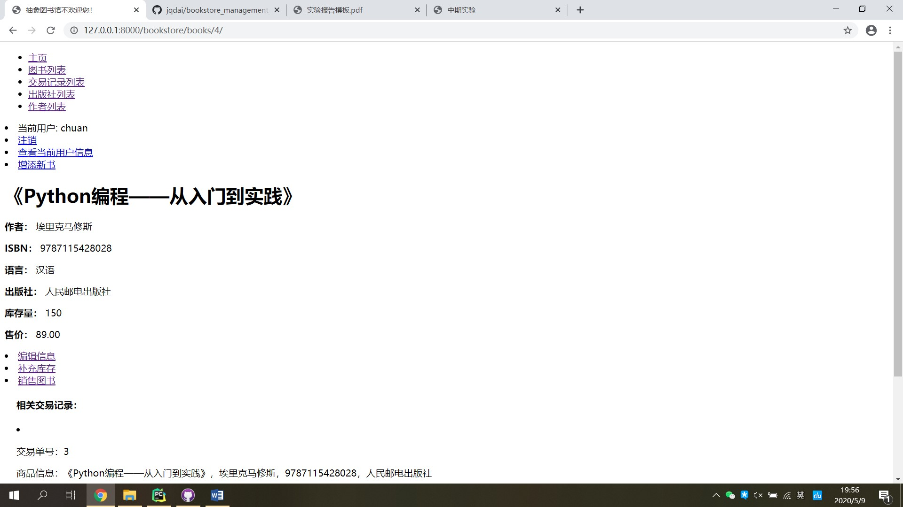

### 4.3 书籍查询

- 系统中可以使用ISBN号、书名、语言、作者、出版社等方式查询库存的相关书籍
- 查询界面如下图所示，页面下方为库存图书列表
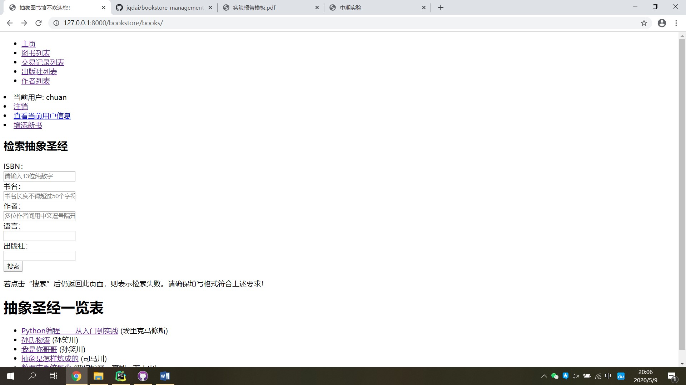
- 图书检索功能所有选项都**不是**必填项，若不填，则认为在该属性上不加限制
- 表单处理略为复杂，尤以不直接储存在本模式中的出版社和作者查询最为麻烦，现将其部分代码附于下方
```python
# views.py book_list
if form.is_valid():
    isbn = form.cleaned_data['ISBN']
    bname = form.cleaned_data['name']
    aname = form.cleaned_data['author']
    lang = form.cleaned_data['language']
    pub = form.cleaned_data['publisher']
    cate = form.cleaned_data['category']
    selected_books = Book.objects.distinct()
    if pub:
        # selected_books = Publisher.objects.get(name=pub).book_set.order_by('name')
        selected_books = Book.objects.filter(publisher__name__contains=pub)
    if isbn:
        selected_books = selected_books.filter(ISBN=isbn)
    if bname:
        selected_books = selected_books.filter(name__contains=bname)
    if aname:
        aname_list = aname.split('，')
        for name in aname_list:
            selected_books = selected_books.filter(author__name__contains=name)
    if lang:
        selected_books = selected_books.filter(language=lang)
    if cate:
        cate_list = cate.split(',')
        for c in cate_list:
            selected_books = selected_books.filter(category__name__contains=c)
    context = {'selected_books': selected_books}
    return render(request, 'bookstore/search.html', context=context)
```
- 检索成功（包括没有符合条件的图书的情况）则会跳转至检索结果页，否则仍返回本页

### 4.4 图书信息修改

- 支持修改书籍名称、作者、出版社、零售价等信息
- 图书信息修改效果展示如下图所示，进入界面时默认填充目前储存的信息
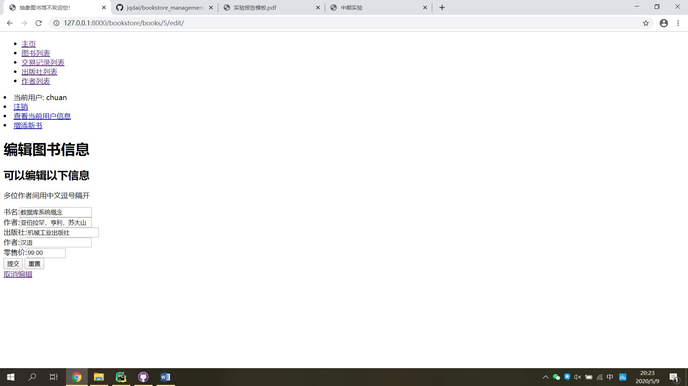
- 其中仍以出版社和作者修改最为麻烦。对于出版社，需要先判断表单中输入的出版社是否已经存在，若不存在则要先新建再修改。对于作者更麻烦一点，要先将原有的图书作者关联关系清除，再判断作者是否已经存在，若不存在先新建，然后再加入与目标图书的关联中
- 图书信息修改页所有栏目**都是**必填项（**注意：除非特殊说明，否则出现的所有表单都是必填项**）
- 对应的视图处理部分代码如下所示
```python
# views.py edit_book
if form.is_valid():
    publishers = Publisher.objects.filter(name=form.cleaned_data['publisher'])
    if not publishers:
        publisher = Publisher(name=form.cleaned_data['publisher'])
        publisher.save()
    else:
        publisher = publishers[0]

    # 修改 author、category 时，先清除原有的多对多关联，再重新加
    targ.author.clear()
    aname_list = form.cleaned_data['author'].split('，')
    for name in aname_list:
        au = Author.objects.filter(name__contains=name)
        if au:
            targ.author.add(au[0])
        else:
            new_author = Author(name=name)
            new_author.save()
            targ.author.add(new_author)

    targ.category.clear()
    cname_list = form.cleaned_data['category'].split('，')
    for name in cname_list:
        ca = Category.objects.filter(name__contains=name)
        if ca:
            targ.category.add(ca[0])
        else:
            new_category = Category(name=name)
            new_category.save()
            targ.author.add(new_category)

    targ.name = form.cleaned_data['name']
    targ.language = form.cleaned_data['language']
    targ.publisher = publisher
    targ.price = form.cleaned_data['price']
    targ.summary = form.cleaned_data['summary']
    targ.save()
    messages.error(request, '修改成功')
    return HttpResponseRedirect(reverse('related_transaction', args=[bid]))
```
- 信息修改成功则会跳转至对应图书的交易记录列表页，否则仍返回本页

### 4.5 图书进货

本系统中，将新书进货与旧书补货分在两个地方处理，处理方式也不相同，并在考虑了实际情况后对实验要求的内容作出了一定修改。下面我们分别来看一下。

#### 4.5.1 新书进货

- 新书进货的入口在主页上，并且每个页面都会显示
- 新书进货要求填写 ISBN 号、书名、语言、作者、出版社、零售价、进价等信息
- 新书上架界面展示如下
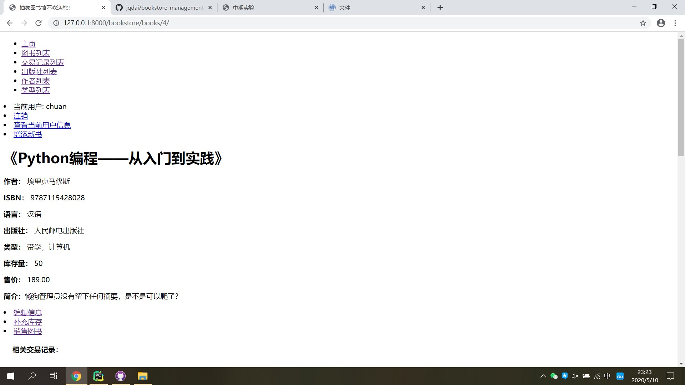
- 新书进货下单后订单状态**直接设为已付款**并**立即**更新库存。这是考虑到对于此前不在书库内的图书，只下单不付款也就没法到货，效果相当于没有加入这本书，因此省去未付款状态而直接上架
- 对应的视图处理部分代码展示如下
```python
#　views.py　new_book
if form.is_valid():
    pubtemp = Publisher.objects.filter(name=form.cleaned_data['publisher'])
    if not pubtemp:
        publisher = Publisher(name=form.cleaned_data['publisher'])
        publisher.save()
    else:
        publisher = pubtemp[0]

    new_book = Book(
        ISBN=form.cleaned_data['ISBN'],
        name=form.cleaned_data['name'],
        language=form.cleaned_data['language'],
        publisher=publisher,
        price=form.cleaned_data['price'],
        inventory=form.cleaned_data['amount'],
        summary=form.cleaned_data['summary'],
    )
    new_book.save()

    author_list = form.cleaned_data['author'].split('，')
    for aname in author_list:
        auth_temp = Author.objects.filter(name=aname)
        if not auth_temp:
            new_author = Author(name=aname)
            new_author.save()
        else:
            new_author = auth_temp[0]
        new_book.author.add(new_author)

    category_list = form.cleaned_data['category'].split('，')
    for cname in category_list:
        cat_temp = Category.objects.filter(name=cname)
        if not cat_temp:
            new_category = Category(name=cname)
            new_category.save()
        else:
            new_category = cat_temp[0]
        new_book.author.add(new_category)

    new_trans = Transaction(
        in_out='进货',
        book=new_book,
        ruler=admin,
        cost=form.cleaned_data['cost'],
        amount=form.cleaned_data['amount'],
        time=timezone.now(),
        paid='已付款',
    )
    new_trans.save()
    messages.error(request, '新书上架成功')
    return HttpResponseRedirect(reverse('transactions'))
```
- 订单提交成功则会跳转至交易记录列表页，否则仍返回本页

#### 4.5.2 旧书补货

- 旧书补货的界面入口在对应图书的详细信息页
- 旧书补货只要求填写补货数量和进价，交易记录中的 cost 属性的值等于进价而非对应图书的 price 值
- 旧书补货界面效果如下所示
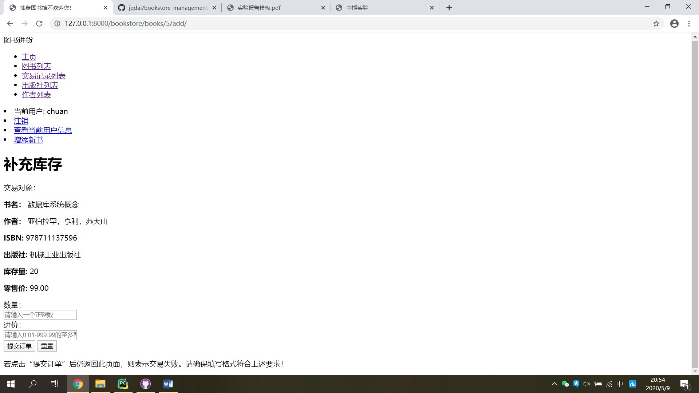
- 旧书补货下单后状态设置为“未付款”并不更新库存，状态转为“已付款”后更新库存（关于对未付款订单的操作见 4.6 节）
- 对应的视图处理部分代码如下所示
```python
# views.py add_book
if form.is_valid():
    book_amount = form.cleaned_data['amount']
    book_cost = form.cleaned_data['cost']
    targ.save()

    new_trans = Transaction(
        in_out='进货',
        book=targ,
        ruler=admin,
        cost=book_cost,
        amount=book_amount,
        time=timezone.now(),
        paid='未付款',
    )
    new_trans.save()
    messages.error(request, '进货成功')
    return HttpResponseRedirect(reverse('transactions'))
```
- 订单提交成功则会跳转至交易记录列表页，否则仍返回本页

### 4.6 进货付款

- 可在订单列表界面查询状态为“未付款”的书籍，并给予付款或退货，状态更新为“已付款”或“已退货”（关于退货的操作见 4.7 节）
- 点击订单列表界面的“去付款/退货”按钮，会看到所有状态为“未付款”的订单，输入出现在这之中的订单号，点击“已付款”，点击提交即可付款并更新库存
- 订单状态更改界面如下所示（演示图片中暂无未付款订单）
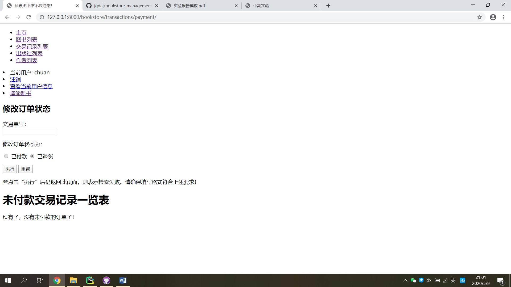
- 对应的试图处理部分代码见 4.7 节

### 4.7  图书退货

- 对未付款的书籍可以进行退货，即将书籍状态改为已退货，方法同上，唯一的区别是点击“已退货”
- 付款和退货对应的视图处理部分代码如下所示
```python
# views.py payment
if form.is_valid():
    tid = form.cleaned_data['tid']
    tpaid = form.cleaned_data['paid']
    trans = unpaid_transactions.get(id=tid)
    if trans:
        trans.paid = tpaid
        if tpaid == '已付款':
            trans.book.inventory += trans.amount
            messages.error(request, '付款成功')
        else:
            messages.error(request, '退货成功')
        trans.save()
        trans.book.save()
        return HttpResponseRedirect(reverse('transactions'))
```
- 订单提交成功则会跳转至交易记录列表页，否则仍返回本页

### 4.8 添加新书

- 此部分内容见 4.5.1 节

### 4.9 图书销售

- 使用标售零售价格购买书籍，这时书籍的库存数量需要相应地减少
- 图书销售的界面入口在对应图书的详细信息页
- 图书销售只要求输入销售数量，交易记录的 cost 属性值自动设置为对应图书的 price 值
- 界面展示如下所示
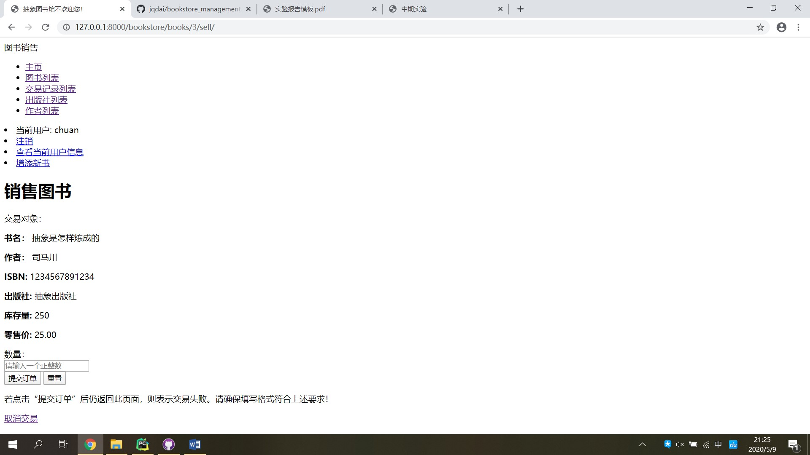
- 对应的视图处理部分代码如下所示
```python
# views.py sell_book
if form.is_valid():
    book_amount = form.cleaned_data['amount']
    invent = targ.inventory
    if book_amount <= invent:
        targ.inventory -= book_amount
        targ.save()

        new_trans = Transaction(
            in_out='出货',
            book=targ,
            ruler=admin,
            cost=targ.price,
            amount=book_amount,
            time=timezone.now(),
            paid=True,
        )
        new_trans.save()
        messages.error(request, '出售成功')
        return HttpResponseRedirect(reverse('related_transaction', args=[bid]))
```
- 订单提交成功则会跳转至对应图书的详细信息页，否则仍返回本页

### 4.10 财务管理

- 当对书籍进货进行付款，或购买书籍时，系统的财务账户都要添加一条账单记录，记录下财务账户的支出或收入
- 所有交易记录列表查看入口在主页，展示效果如下图所示
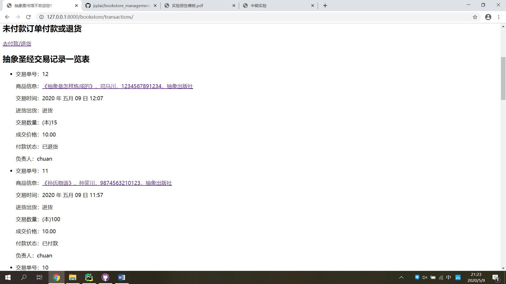

### 4.11 查看账单

- 查看某段时间内财务账户的收入或支出记录
- 检索入口在交易记录列表页
- 注意起始时间和结束时间**都是必填项**
- 效果展示如下所示
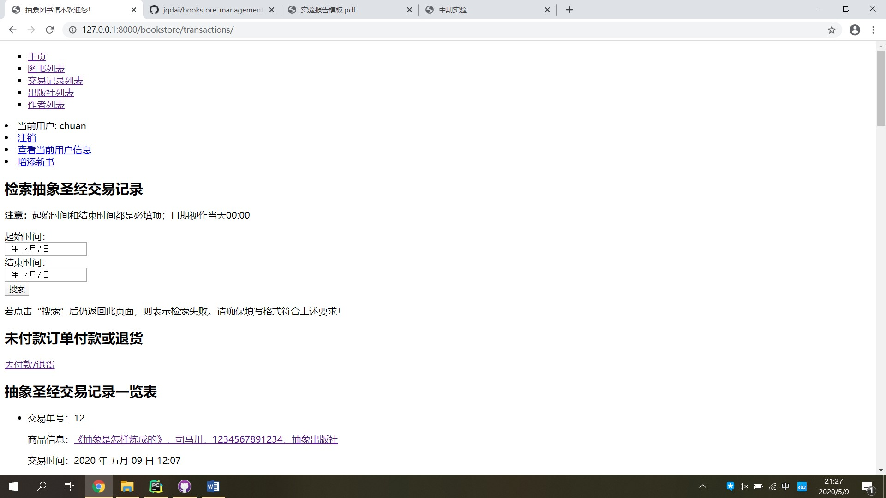
- 本页出现的表单中，只有订单状态**不是**必填项
- 对应视图处理部分代码如下所示
```python
# views.py transactions
if form.is_valid():
    stime = form.cleaned_data['start_time']
    etime = form.cleaned_data['end_time']
    stat = form.cleaned_data['stat']
    selected_trans = Transaction.objects.filter(time__range=(stime, etime))
    if stat:
        selected_trans = selected_trans.filter(in_out=stat)
    context = {'selected_trans': selected_trans}
    return render(request, 'bookstore/time_span.html', context=context)
```

## 5 特色和创新点

### 5.1 优化的数据库模式

- Author、Publisher、Category 的设置及其带来的对 Book、Transaction 的影响
众所周知，一本书只能由一个出版社出版，一个出版社则可以出版多本图书；一本书可以有多个作者，一名作者也可以创作多本图书；一本书可以属于多个类别，一个类别也可以包含多本书。因此我们对原先简单的单值属性 publisher、author、category 进行一定改进，将之设置为独立的三个模式，通过外键或多对多关系与图书模式相联系
因此我们也需要对图书和订单模式进行重构。外键较为简单，如出版社之于图书、图书之于订单，通过 book.publisher.name 即可实现原先 book.publisher 的返回出版社名称的功能
对于多对多关系，例如我们想要知道一本书的全部作者或类别，则要新定义方法 get_author、get_category 而不能像原来那样直接通过 author、category 属性访问。以 get_author 方法为例，该方法代码展示如下（此处利用 .join() 方法将多为作者整合成一个长字符串，方便显示）。get_category 的实现大致相同
```python
# models.py Book
def get_author(self):
    return '，'.join([a.name for a in self.author.order_by('name')])
```
- Phone 的设置及其带来的对 Admin 的影响
一名管理员可以有多个电话，一个电话只能属于一名管理员，同样使用外键重构 Admin，方法和作用大致同上
- 新书上架与旧书补货分离，进货订单与出货订单合并
虽然同样是进货，新书和旧书的进货还是有所不同的。新书进货若付款也就没有实际货物，因此效果等价于没进货没上架，所以当图书上架时必定已经付款，因而新书进货订单状态默认设置为“已付款”。旧书补货则先设置为“未付款”，再根据情况付款或退货
进货和出货的订单可以储存在一起，通过 in_out 属性区分进货出货。cost 属性的值，对于进货订单来说是进价，多余出货订单来说是零售价。每个订单都有其交易主体、成交量、负责人等属性

### 5.2 丰富多样的检索功能

- 为 Book、Author、Publisher、Category、Transaction 等模式提供检索，支持其全部属性上的检索
- 一次检索多名作者或类型时，输入通过中文逗号隔开，相当于输入一个由多个作者（类型）合成的长字符串
- 除了订单查询中的起始时间和结束时间**是必填项**外，其余所有选项都**不是**必填项
- 处理作者或类型检索时，使用 split 将输入的合成长字符串拆开，分别检索，结果取交集
- 检索时采用 __contain 片段搜索，支持的属性包括图书出版社名称、单个作者姓名、书名等。部分代码如下所示
```python
# views.py book_list
aname = form.cleaned_data['author']
if aname:
    aname_list = aname.split('，')
    for name in aname_list:
        selected_books = selected_books.filter(author__name__contains=name)
```

### 5.3 贴近实际的设计

- **不**设置注册功能，现实中管理员账号是不可能开放注册的！
- **不**为每本书设置一个实例。虽然名字叫抽象“图书馆”，但咱们这是卖书不是图书馆借书嗷，每本书弄个实例没必要
- 所欲外键均设置为 on_delete=models.**DO_NOTHING**，因为即便管理员跑路了他负责的订单仍应记录在案，即便出版社倒闭了它出版过的书也不应删除
- 订单模式中加入负责人（下单者）属性，支持根据负责人检索订单（在负责人个人信息界面展示其负责的订单）
```python
# models.py Transaction
ruler = models.ForeignKey(Admin, on_delete=models.DO_NOTHING, verbose_name='执行交易的管理员')
```
- 改密码用邮件验证，通过以下代码将邮件发到终端，模拟接收邮件。效果展示见 4.1 节
```python
# settings.py
EMAIL_BACKEND = 'django.core.mail.backends.console.EmailBackend'
```
- 图书模式中加入语言属性
```python
# models.py Book
language = models.CharField(max_length=10, verbose_name='语言', default='汉语')
```

### 5.4 便捷准确的操作

- 日期选择使用日期选择器
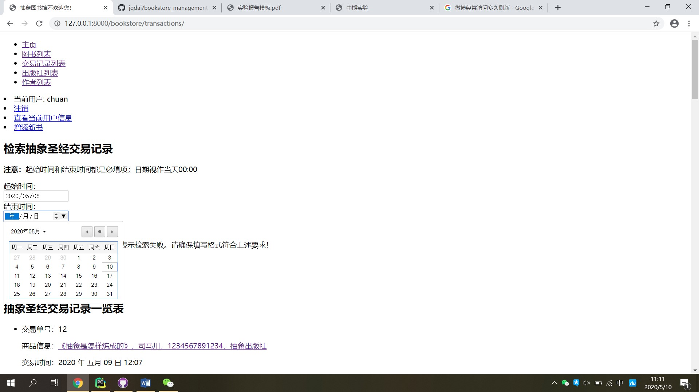
- 查询 / 检索界面设置“重置”按钮重置筛选条件
```html
<!--用了两种方法，上面的是 transaction_list.html 中的，下面的是 profile_update.html 中的-->
<button type="reset">重置</button>
<input type="reset" value="重置">
```
- 管理员个人信息修改界面男/女、订单状态修改界面已付款/已退货做成单选题
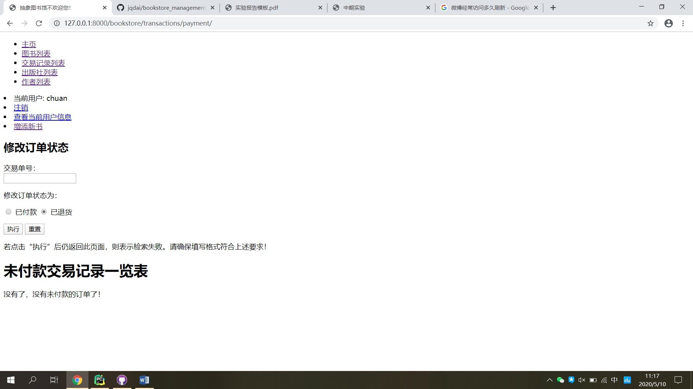
- 表单提交后有提示弹窗（emmmm 虽然大部分情况下会延后弹出且暂时没有搞定这个问题 但还是有几个界面能正常显示的！）
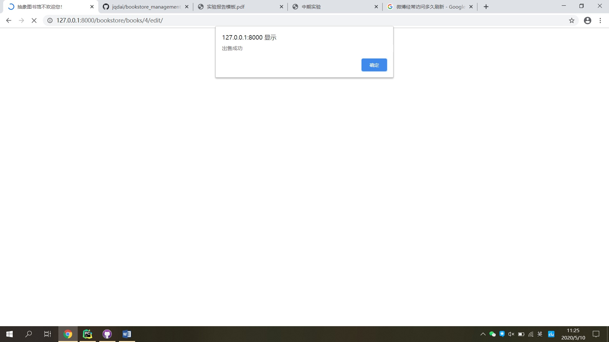

### 5.5 其它

- 主页显示全书店图书种类总数、订单总数、用户访问主页的次数（关闭页面不归零）。效果展示和部分代码如下所示
```python
# views.py index
num_books = Book.objects.all().count()
num_transactions = Transaction.objects.all().count()
num_visits = request.session.get('num_visits', 0)
request.session['num_visits'] = num_visits + 1
ct = {'num_books': num_books, 'num_transactions': num_transactions, 'num_visits': num_visits}
return render(request, 'index.html', context=ct)
```
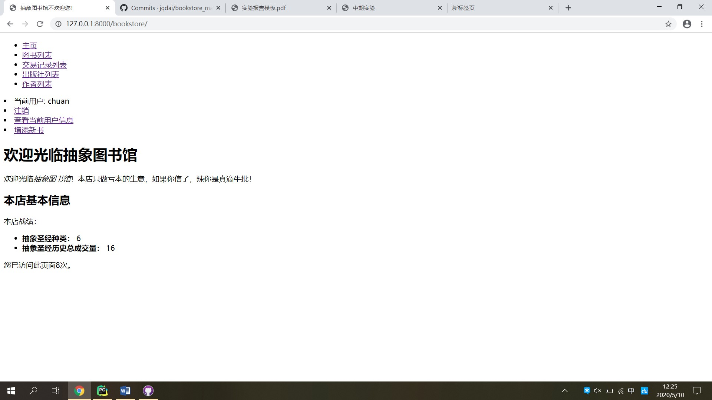
- 使用表单（新建 foms.py 放了一堆表单，然后再在 views.py 里调用，大大减少了代码量）。forms.py 文件大致情况如下所示
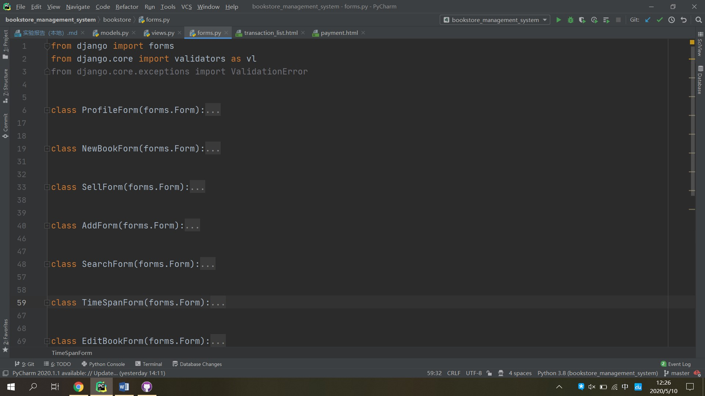
- 手机号、订单状态等属性使用正则表达式验证（ISBN 号仅验证长度为 13 是为了方便演示，其使用方法与电话略同）。部分代码如下所示
```python
# models.py Phone
number = models.CharField(max_length=11, verbose_name='联系方式（手机）', help_text='请输入中国大陆11位手机号', validators=
                         [vl.RegexValidator(regex='^1(3|5|7|8|9)\d{9}$', message='请确保手机号格式正确！')])
# models.py Transaction
in_out = models.CharField(max_length=2, verbose_name='进货/出货', help_text='请输入“进货”或者“出货”', validators=
                          [vl.RegexValidator(regex=(r'^(?:进货|出货)$'), message='请确保输入“进货”或者“出货”之一！')])
# models.py Book
ISBN = models.CharField(max_length=13, verbose_name='ISBN号', help_text='请输入纯数字ISBN（不带横杠）', validators=
                        [vl.RegexValidator(regex='^\d{13}$', message='请确保ISBN格式正确！')])
```

## 6 提交文件说明

### 6.1 运行方法

- 解压后在 IDE 中打开项目文件夹，推荐使用 pycharm 2020.1（专业版）
- 在此处打开终端，执行以下命令

```text
py manage.py runserver
```

- 访问127.0.0.1:8000即可进入主页，推荐使用 Google Chrome 浏览器

### 6.2 URL 说明

- 所有网页都必须先登录再查看内容或操作
- 以下各网址前缀 127.0.0.1:8000 已省略
- admin/ 超级管理员网站
- bookstore/ 默认主页
- bookstore/books 图书列表（含检索功能）
- bookstore/book/<int:bid> 查看图书信息与相关交易记录
- bookstore/book/<int:bid>/io 在库图书补货与销售
- bookstore/book/<int:bid>/edit 修改图书信息
- bookstore/newbook/ 新书上架
- bookstore/transactions 所有交易记录（含检索功能）
- bookstore/transactions/payment 订单付款和退货
- bookstore/user/<int:uid>/profile 查看用户个人信息
- bookstore/user/<int:uid>/profile/update 修改用户个人信息
- bookstore/publishers 出版社列表
- bookstore/publishers/<int:pid> 查看出版社信息
- bookstore/publishers/<int:pid>/update 出版出版社信息
- bookstore/author 作者列表
- bookstore/authors/<int:aid> 查看作者信息
- bookstore/authors/<int:aid>/update 修改作者信息
- bookstore/categories/ 类型列表
- bookstore/categories/<int:cid>/ 查看类型信息
- bookstore/categories/<int:cid>/update/ 修改类型信息
- accounts/login 登录
- accounts/password_reset 通过邮件重置密码

### 6.3 供试验用的超级管理员账号

- 用户名：chuan
- 密码：12345678
- 邮箱：6324upup@258.com
- 修改密码的验证邮件在终端查收

## 7 实验总结

### 7.1 收获

- 第一次接触 Web 开发，学习了有关 python 和 django 的若干知识
- 第一次接触 html，很累但学会了如何写简单的网页
- 了解了若干有关前后端交互的知识
- 了解了 git 和 github 的使用方法（和重要性！）
- 加深了对冗余、多值属性、复合属性、ER 图、外键等数据库设计有关知识的理解
- 加深了对数据库查询的理解

### 7.2 困难

- 第一次玩 django 还曾经把项目玩崩了，导致原来的项目跑不起来了（就是 github 上所谓的“隔壁 bsm”，这个没开源）
- 第一次玩表单，用 widget=forms.widgets.Select(choices=states)) 做二选一那里卡了很久……
- 关于 django 的 ForeignKey、ManyToMany 的用法有点搞，尤其是在数据库中已经有数据的情况下向模式中加入新的模式和外键、多对多关系，容易造成崩溃（其实中间就是因为这个挂了一次……）。最好的办法还是在第一次迁移之前就确定数据库模式，然后再往数据库里加数据
- 正则表达式和 url 匹配问题也卡了好久
- message 至今没法及时显示……总是延迟一次请求（虽然好像本来就是这么定义的？）

### 7.3 展望

- 再扩充功能，使之成为能同时为书店管理员和书店顾客服务的系统。
- 另外建立 Customer（顾客）、Purchase（顾客订单）等模式
- Transaction 模式改为只记录管理员进货订单，原先 Transaction 中 in_out 属性值为“出货”的订单转由 Purchase 储存
- 分别为顾客和管理员分配权限等
- 与 Transaction 中包含到 Admin 和 Book 的外键相似，Purchase 中也包含到 Customer 和 Book 的外键，表示是谁买的什么书
- 前面耽误太久了来不及做什么美化了，以前用过 MDUI 感觉不错，之后花里胡哨一下
