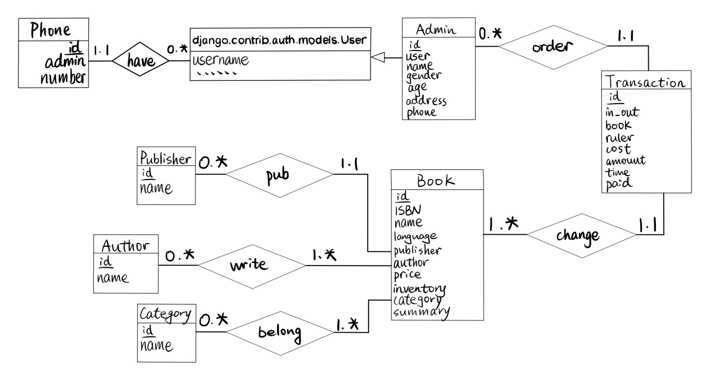
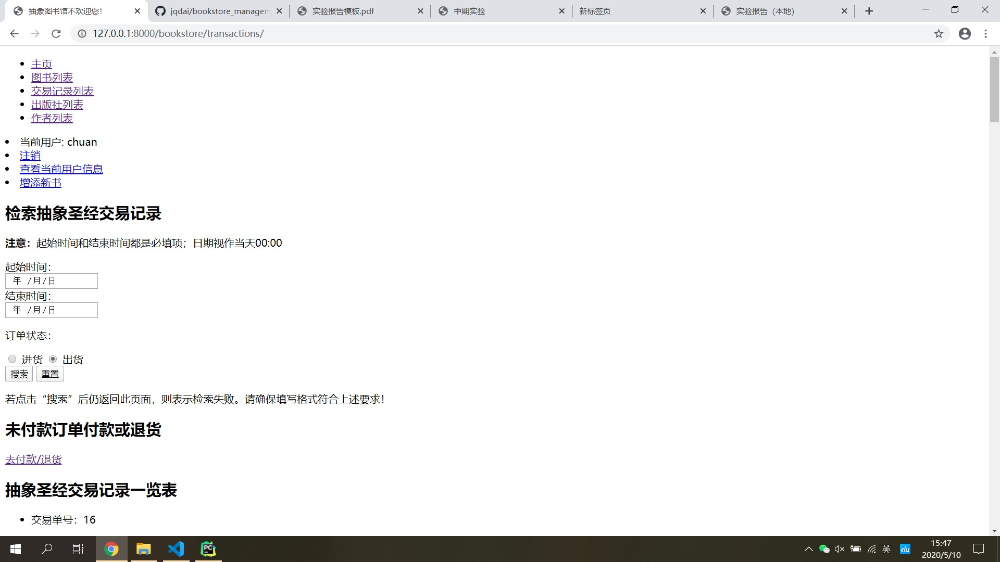

# 实验报告

戴嘉麒 18307130006

## 1 实验题目

- 图书销售管理系统的设计与实现
- 项目地址：[demo](https://github.com/jqdai/bookstore_management_system)

## 2 开发环境

- 操作系统：Windows 10 64位（DirectX 12）
- IDE：pycharm 2020.1（专业版）
- 数据库管理软件：sqlite3
- 编程语言：python 3.8
- Web开发环境：django 3.0.5

## 3 数据库设计

介绍本项目的数据库设计，给出系统数据库的 ER 图，对每个表的功能和属性进行说明。

### 3.1 数据库设计简介与 ER 图

- 本项目共设计有 5 个模式: Admin, Publisher, Author, Book, Transaction
- ER 图如下图所示



### 3.2 各模式功能与属性说明

#### 3.2.1 Admin

属性

- id: 自动生成的主码
- user: 利用 django 自带的用户系统维护用户名、密码、邮箱等信息
- name: 真实姓名
- gender: 性别
- age: 年龄
- address: 住址（复合属性本应拆分为 city、street 等属性，此处简化无伤大雅）
- phone: 电话（可以作为多值属性，但一方面实际场景中不会记录多个电话，另一方面多值属性的处理方法在下面的 Author 模式中有体现，因此此处不作多值属性处理）

方法

- __str\_\_(self): 返回用户名（注意是 self.**user**.get_username() ）

功能

- 在 django 自带用户系统的基础上扩充几个信息，但真正起到登录、改密码等作用的是自带的 django.contrib.auth.models.User
- 在 Transaction 模式中，每条交易记录要注明是谁下的单，就是通过 ruler 属性记录的 Admin（其实是 username）实现的
- 通过 ForeignKey 成为 Transaction 模式的 ruler 属性，表示每个订单的负责人。一个订单只能有唯一的负责人，而一个管理员可以下很多单
- 支持检索和修改信息

#### 3.2.2 Publisher

属性

- id: 自动生成的主码
- name: 出版社名称

方法

- __str\_\_(self): 返回出版社名称
- get_absolute_url(self): 返回一个通向该出版社详细信息页的 url，以其 id 属性作为参数，并显示其出版的图书

功能

- 维护所有出现过的出版社名称，并在其详细信息页显示其名称、出版书籍等信息且可修改
- 通过 ForeignKey 成为 Book 模式的 publisher 属性，表示每本图书的出版社。一本书只能有唯一的出版社，而一个出版社可以出版多本图书
- 支持检索和修改信息

#### 3.2.3Author

属性

- id: 自动生成的主码
- name: 作者姓名

方法

- __str\_\_(self): 返回作者姓名
- get_absolute_url(self): 返回一个通向该作者详细信息页的 url，以其 id 属性作为参数，并显示其创作的图书

功能

- 维护所有出现过的作者姓名，并在其详细信息页显示其姓名、所作图书等信息且可修改
- 通过 MayToManyField 成为 Book 模式的 author 属性，表示每本图书的作者。一本书可以有多个作者，一个作者也可以写多本书
- 支持检索和修改信息
- 因此处表现了多值属性的特性，因此 Admin 模式中的 phone 属性简化为单值属性无伤大雅

#### 3.2.4 Book

属性

- id: 自动生成的主码
- ISBN: ISBN国际书号
- language: 语言
- author: 作者，通过 ManyToManyField 用 Author 模式储存
- publisher: 出版社， 通过 ForeignKey 用Publisher 模式储存
- price: 零售价
- inventory: 库存数量

方法

- __str\_\_(self): 返回一个表示图书信息的字符串：《书名》，作者，国际书号，出版社
- get_absolute_url(self): 返回一个通向该图书详细信息页的 url，以其 id 属性作为参数，并显示其交易记录
- get_author(self): 返回图书全部作者，根据图书去 Author 模式中查找相应的作者，若有多位则使用'，'.join(...)的方法返回一个字符串

功能

- 维护所有出现过的图书，并在其详细信息页显示其名称、国际书号、作者、出版社等信息且可修改
- 通过 MayToManyField 利用 Author 模式储存作者信息，避免冗余和不一致
- 通过 ForeignKey 利用 Publisher 模式储存出版社信息，避免冗余和不一致
- 通过 ForeignKey 成为 Transaction 模式的 book 属性，表示每条交易记录的交易主体。一条记录只能有唯一的交易主体，一本书也可以有多条交易记录
- 支持检索和修改信息

#### 3.2.5 Transaction

属性

- in_out: 区别订单类型，是进货还是出货
- book: 交易主体，通过 ForeignKey 利用 Book 模式储存
- ruler: 订单负责人（下单人）， 通过 ForeignKey 利用 Admin 模式储存
- cost: 成交金额。若是进货，则表示进价；若是出货，则表示零售价
- amount: 成交量
- time: 成交时间，由系统自动生成
- paid: 订单付款状态。不在库中的图书进货和库存图书销售下单后自动设为“已付款”，库存图书进货则设为“未付款”。对未付款订单，可以手动付款，状态更新为“已付款”，同时自动增加库存量；也可选择退货，状态更新为“已退款”，不更新库存

方法

- __str\_\_(self): 返回一个表示订单的字符串
- recent_deal(self): 返回在过去一天内成交的订单（实际并未使用）

功能

- 维护所有成交过的订单，可根据自定义的时间范围检索
- 通过 ForeignKey 利用 Book 模式储存商品信息，避免冗余和不一致

## 4 系统设计

这里主要展现实验要求中要求的十一条，其余的放在第 5 节中展示
对照实验要求，展示系统的主要功能。适当截图，对每个功能内部的实现流程进行说明。对某些关键的功能实现，通过展示代码来分析。

### 4.1 用户管理

- 所有注册账号均能访问 127.0.0.1:8000\bookstore（一下简称主页），在主页上可以买卖图书，修改自己的信息和账号密码，查看数据库储存的各种信息
- 只有超级管理员才有权限登录 admin 站点，在该站点中超级管理员除了能进行主页上的操作外，可以查看、修改其它管理员的个人信息，也能新增管理员
- 超级管理员是项目建立时通过以下命令建立的，普通管理员则是超级管理员在 admin 站点手动建立的
```text
py manage.py createsuperuser
```
- 由于本系统利用了 django 自带的用户管理系统，因此密码加密方式采用了其默认的 pbkdf2_sha256 算法
- 下图是超级管理员编辑其它管理员信息时的情形

- 每位用户除了用户名和密码信息外，还有姓名，性别，年龄，住址，电话等基本信息
- 本系统中，views 中所有视图都加上了@login_required，因此所有网页的内容必须登录后才能查看


### 4.2 库存书籍管理

- 系统维护的书籍信息包括ISBN号，书籍名称，语言，作者，出版社，零售价格，当前库存数量等
- 图书信息模式设计如 views.py 中 Book 模式所示
- 图书详细信息展示效果如下图所示


### 4.3 书籍查询

- 系统中可以使用ISBN号、书名、语言、作者、出版社等方式查询库存的相关书籍
- 查询界面如下图所示

- 图书检索功能所有选项都**不是**必填项，若不填，则认为在该属性上不加限制
- 表单处理略为复杂，尤以不直接储存在本模式中的出版社和作者查询最为麻烦，现将其部分代码附于下方
```python
# views.py book_list
if form.is_valid():
    isbn = form.cleaned_data['ISBN']
    bname = form.cleaned_data['name']
    aname = form.cleaned_data['author']
    lang = form.cleaned_data['language']
    pub = form.cleaned_data['publisher']
    selected_books = Book.objects.distinct()
    if pub:
        selected_books = Publisher.objects.get(name=pub).book_set.order_by('name')
    if isbn:
        selected_books = selected_books.filter(ISBN=isbn)
    if bname:
        selected_books = selected_books.filter(name=bname)
    if aname:
        aname_list = aname.split('，')
        for name in aname_list:
            selected_books = selected_books.filter(author__name__contains=name)
    if lang:
        selected_books = selected_books.filter(language=lang)
    context = {'selected_books': selected_books}
    return render(request, 'bookstore/search.html', context=context)
```
- 查询成功（即便没有符合条件的图书）则会跳转至结果页，否则仍返回本页

### 4.4 图书信息修改

- 支持修改书籍名称、作者、出版社、零售价等信息
- 图书信息修改效果展示如下图所示

- 其中仍以出版社和作者修改最为麻烦。对于出版社，需要先判断表单中输入的出版社是否已经存在，若不存在则要先新建再修改。对于作者更麻烦一点，要先将原有的图书作者关联关系清除，再判断作者是否已经存在，若不存在先新建，然后再加入与目标图书的关联中
- 对应的视图处理部分代码如下所示
```python
# views.py edit_book
if form.is_valid():
    publishers = Publisher.objects.filter(name=form.cleaned_data['publisher'])
    if not publishers:
        publisher = Publisher(name=form.cleaned_data['publisher'])
        publisher.save()
    else:
        publisher = publishers[0]

    # 修改 author 时，先清除原有的多对多关联，再重新加
    targ.author.clear()
    aname_list = form.cleaned_data['author'].split('，')
    for name in aname_list:
        au = Author.objects.filter(name__contains=name)
        if au:
            targ.author.add(au[0])
        else:
            new_author = Author(name=name)
            new_author.save()
            targ.author.add(new_author)

    targ.name = form.cleaned_data['name']
    targ.language = form.cleaned_data['language']
    targ.publisher = publisher
    targ.price = form.cleaned_data['price']
    targ.save()
    messages.error(request, '修改成功')
    return HttpResponseRedirect(reverse('related_transaction', args=[bid]))
```
- 信息修改成功则会跳转至对应图书的交易记录列表页，否则仍返回本页

### 4.5 图书进货

本系统中，将新书进货与旧书补货分在两个地方处理，处理方式也不相同，并在考虑了实际情况后对实验要求的内容作出了一定修改。下面我们分别来看一下。

#### 4.5.1 新书进货

- 新书进货的入口在主页上，并且每个页面都会显示
- 新书进货要求填写 ISBN 号、书名、语言、作者、出版社、零售价、进价等信息
- 新书上架界面展示如下

- 新书进货下单后订单状态**直接设为已付款**并**立即**更新库存。这是考虑到对于此前不在书库内的图书，只下单不付款也就没法到货，效果相当于没有加入这本书，因此省去未付款状态而直接上架
- 对应的视图处理部分代码展示如下
```python
#　views.py　new_book
if form.is_valid():
    pubtemp = Publisher.objects.filter(name=form.cleaned_data['publisher'])
    if not pubtemp:
        publisher = Publisher(name=form.cleaned_data['publisher'])
        publisher.save()
    else:
        publisher = pubtemp[0]
    new_book = Book(
        ISBN=form.cleaned_data['ISBN'],
        name=form.cleaned_data['name'],
        language=form.cleaned_data['language'],
        publisher=publisher,
        price=form.cleaned_data['price'],
        inventory=form.cleaned_data['amount'],
    )
    new_book.save()
    author_list = form.cleaned_data['author'].split('，')
    for aname in author_list:
        auth_temp = Author.objects.filter(name=aname)
        if not auth_temp:
            new_author = Author(name=aname)
            new_author.save()
        else:
            new_author = auth_temp[0]
        new_book.author.add(new_author)

    new_trans = Transaction(
        in_out='进货',
        book=new_book,
        ruler=admin,
        cost=form.cleaned_data['cost'],
        amount=form.cleaned_data['amount'],
        time=timezone.now(),
        paid='已付款',
    )
    new_trans.save()
    messages.error(request, '新书上架成功')
    return HttpResponseRedirect(reverse('transactions'))
```
- 订单提交成功则会跳转至交易记录列表页，否则仍返回本页

#### 4.5.2 旧书补货

- 旧书补货的界面入口在对应图书的详细信息页
- 旧书补货只要求填写补货数量和进价，交易记录中的 cost 属性的值等于进价而非对应图书的 price 值
- 旧书补货界面效果如下所示

- 旧书补货下单后状态设置为“未付款”并不更新库存，状态转为“已付款”后更新库存（关于对未付款订单的操作见 4.6 节）
- 对应的视图处理部分代码如下所示
```python
# views.py add_book
if form.is_valid():
    book_amount = form.cleaned_data['amount']
    book_cost = form.cleaned_data['cost']
    targ.save()

    new_trans = Transaction(
        in_out='进货',
        book=targ,
        ruler=admin,
        cost=book_cost,
        amount=book_amount,
        time=timezone.now(),
        paid='未付款',
    )
    new_trans.save()
    messages.error(request, '进货成功')
    return HttpResponseRedirect(reverse('transactions'))
```
- 订单提交成功则会跳转至交易记录列表页，否则仍返回本页

### 4.6 进货付款

- 可在订单列表界面查询状态为“未付款”的书籍，并给予付款或退货，状态更新为“已付款”或“已退货”（关于退货的操作见 4.7 节）
- 点击订单列表界面的“去付款/退货”按钮，会看到所有状态为“未付款”的订单，输入出现在这之中的订单号，点击“已付款”，点击提交即可付款并更新库存
- 订单状态更改界面如下所示（演示图片中暂无未付款订单）

- 对应的试图处理部分代码见 4.7 节

### 4.7  图书退货

- 对未付款的书籍可以进行退货，即将书籍状态改为已退货，方法同上，唯一的区别是点击“已退货”
- 付款和退货对应的视图处理部分代码如下所示
```python
# views.py payment
if form.is_valid():
    tid = form.cleaned_data['tid']
    tpaid = form.cleaned_data['paid']
    trans = unpaid_transactions.get(id=tid)
    if trans:
        trans.paid = tpaid
        if tpaid == '已付款':
            trans.book.inventory += trans.amount
            messages.error(request, '付款成功')
        else:
            messages.error(request, '退货成功')
        trans.save()
        trans.book.save()
        return HttpResponseRedirect(reverse('transactions'))
```
- 订单提交成功则会跳转至交易记录列表页，否则仍返回本页

### 4.8 添加新书

- 此部分内容见 4.5.1 节

### 4.9 图书销售

- 使用标售零售价格购买书籍，这时书籍的库存数量需要相应地减少
- 图书销售的界面入口在对应图书的详细信息页
- 图书销售只要求输入销售数量，交易记录的 cost 属性值自动设置为对应图书的 price 值
- 界面展示如下所示

- 对应的视图处理部分代码如下所示
```python
# views.py sell_book
if form.is_valid():
    book_amount = form.cleaned_data['amount']
    invent = targ.inventory
    if book_amount <= invent:
        targ.inventory -= book_amount
        targ.save()

        new_trans = Transaction(
            in_out='出货',
            book=targ,
            ruler=admin,
            cost=targ.price,
            amount=book_amount,
            time=timezone.now(),
            paid=True,
        )
        new_trans.save()
        messages.error(request, '出售成功')
        return HttpResponseRedirect(reverse('related_transaction', args=[bid]))
```
- 订单提交成功则会跳转至对应图书的详细信息页，否则仍返回本页

### 4.10 财务管理

- 当对书籍进货进行付款，或购买书籍时，系统的财务账户都要添加一条账单记录，记录下财务账户的支出或收入
- 所有交易记录列表查看入口在主页，展示效果如下图所示


### 4.11 查看账单

- 查看某段时间内财务账户的收入或支出记录
- 检索入口在交易记录列表页
- 注意起始时间和结束时间**都是必填项**
- 效果展示如下所示

- 对应视图处理部分代码如下所示
```python
# views.py transactions
if form.is_valid():
    stime = form.cleaned_data['start_time']
    etime = form.cleaned_data['end_time']
    selected_trans = Transaction.objects.filter(time__range=(stime, etime))
    context = {'selected_trans': selected_trans}
    return render(request, 'bookstore/time_span.html', context=context)
```

## 5 特色和创新点

- ？

## 6 提交文件说明

### 6.1 运行方法

- 解压后在 IDE 中打开项目文件夹，推荐使用 pycharm 2020.1（专业版）
- 在此处打开终端，执行以下命令

```text
py manage.py runserver
```

- 访问127.0.0.1:8000即可进入主页，推荐使用 Google Chrome 浏览器

### 6.2 URL 说明

- 所有网页都必须先登录再查看内容或操作
- 以下各网址前缀 127.0.0.1:8000 已省略
- admin/ 超级管理员网站
- bookstore/ 默认主页
- bookstore/books 图书列表（含检索功能）
- bookstore/book/<int:bid> 查看图书信息与相关交易记录
- bookstore/book/<int:bid>/io 在库图书补货与销售
- bookstore/book/<int:bid>/edit 修改图书信息
- bookstore/newbook/ 新书上架
- bookstore/transactions 所有交易记录（含检索功能）
- bookstore/transactions/payment 订单付款和退货
- bookstore/user/<int:uid>/profile 查看用户个人信息
- bookstore/user/<int:uid>/profile/update 修改用户个人信息
- bookstore/publishers 出版社列表
- bookstore/publishers/<int:pid> 查看出版社信息
- bookstore/publishers/<int:pid>/update 出版出版社信息
- bookstore/author 作者列表
- bookstore/authors/<int:aid> 查看作者信息
- bookstore/authors/<int:aid>/update 修改作者信息
- accounts/login 登录
- accounts/password_reset 通过邮件重置密码

### 6.3 超级管理员账号

- 用户名：chuan
- 密码：12345678
- 邮箱：6324upup@258.com
- 修改密码的验证邮件在终端查收

## 7 实验总结

### 7.1 收获

### 7.2 困难

